> React Native v0.73.10
> 
> node v18.16.0
> 
> npm 9.5.1

## Telas do aplicativo desenvolvido

> Página Inicial

    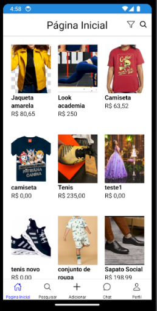

> Meus Produtos

    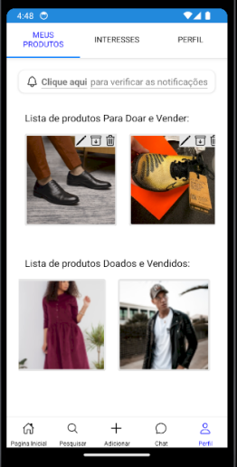

> Interesses

    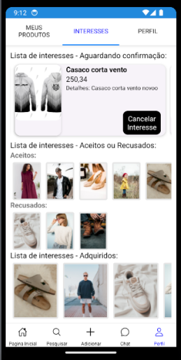

> Detalhes do Produto

    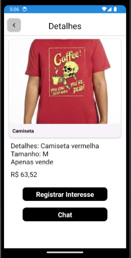
    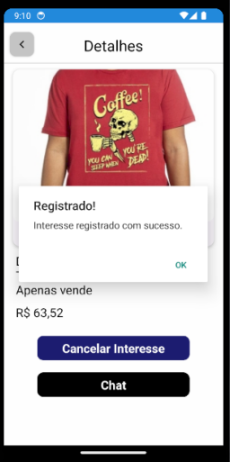
    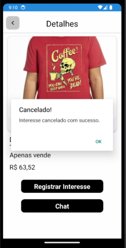
    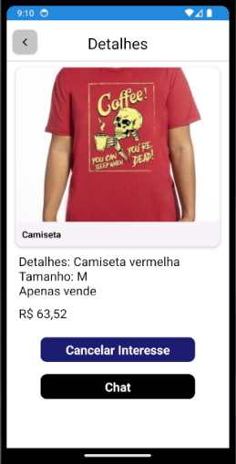 

> Chats

    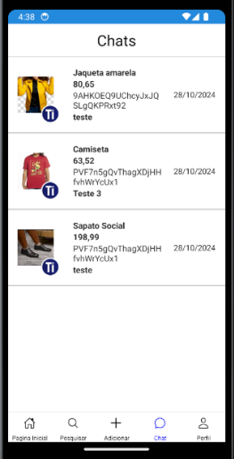
    

> Adicionar Produto

    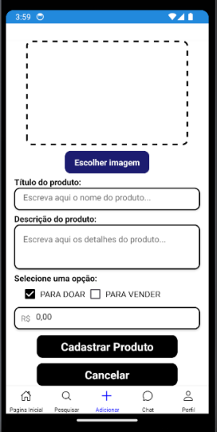

> Pesquisar/Filtrar

    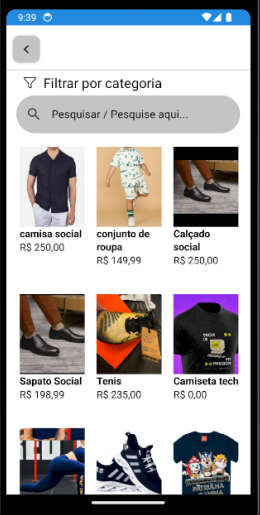
    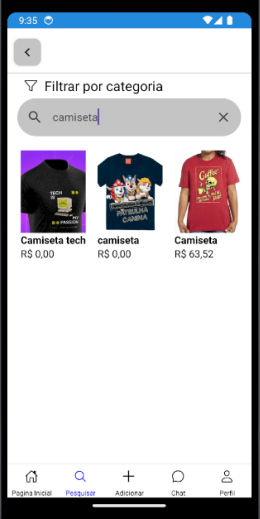

> Login

    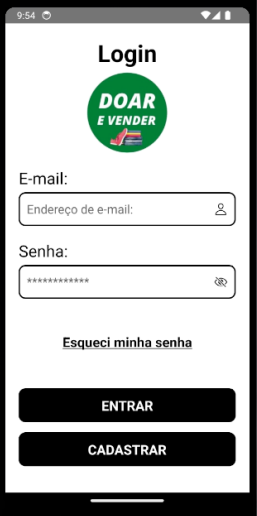

> Cadastrar

    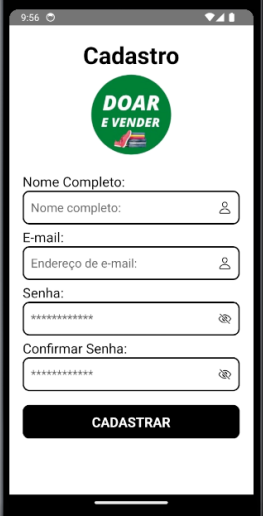

